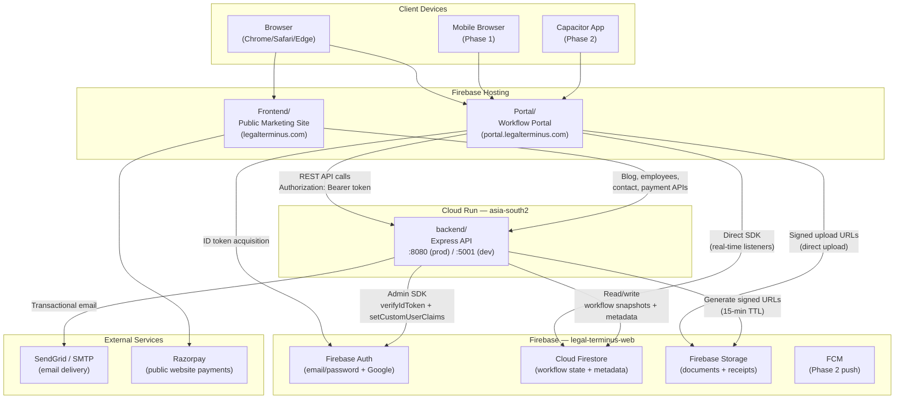

# Legal-Terminus Workflow Portal — Architecture Document

**Version**: 1.0  
**Date**: 2026-05-31  
**Author**: Winston (BMAD Architect Agent)  
**Status**: Draft — ready for developer review

---

## Table of Contents

1. [System Overview](#1-system-overview)
2. [Portal Frontend Architecture](#2-portal-frontend-architecture)
3. [Backend API Architecture](#3-backend-api-architecture)
4. [XState Workflow Engine — Detailed Design](#4-xstate-workflow-engine--detailed-design)
5. [Firestore Data Architecture](#5-firestore-data-architecture)
6. [Authentication & Authorisation](#6-authentication--authorisation)
7. [Document Storage](#7-document-storage)
8. [Notification Architecture](#8-notification-architecture)
9. [Deployment Architecture](#9-deployment-architecture)
10. [Development Environment](#10-development-environment)
11. [Open Technical Decisions](#11-open-technical-decisions)

---

## 1. System Overview

Legal-Terminus is a legal-services firm that replaces ad-hoc WhatsApp/email coordination with a structured, workflow-driven management portal. The system serves four roles — `admin`, `manager`, `team_member`, and `client` — coordinated through XState v5 state machines persisted in Firestore.

### 1.1 High-Level Component Diagram



### 1.2 How Portal and Frontend Coexist

| Concern | `Frontend/` | `Portal/` |
|---|---|---|
| Purpose | Public marketing website | Internal workflow portal |
| URL | `legalterminus.com` | `portal.legalterminus.com` |
| Firebase Hosting target | `public` site target | `portal` site target |
| Backend API | Uses existing routes (`/api/admin/blog`, `/api/employees`, etc.) | Adds new routes (`/api/tasks`, `/api/workflows`, etc.) |
| Auth | Not required (public) | Required (all routes protected) |
| Razorpay | Integrated for public service purchases | Not used in Phase 1 |

Both apps share the **same Cloud Run backend** and the same **Firebase project**. The backend distinguishes requests by path prefix. No route conflicts exist today, and new Portal routes use distinct prefixes.

---

## 2. Portal Frontend Architecture

### 2.1 Directory Structure

```
Portal/
├── index.html
├── vite.config.ts
├── tsconfig.json
├── package.json
├── .env.local                    # Firebase config + API base URL
├── capacitor.config.ts           # Phase 2 — Capacitor native wrapper config
│
└── src/
    ├── main.tsx                  # App entry; Firebase init; StrictMode
    ├── App.tsx                   # Root router + auth provider
    │
    ├── routes/                   # React Router v7 route definitions
    │   ├── index.tsx             # createBrowserRouter — all routes
    │   ├── ProtectedRoute.tsx    # Auth + role guard wrapper
    │   └── RoleRedirect.tsx      # Redirects to role-specific home on login
    │
    ├── pages/                    # Organised by FEATURE, never by role (role-neutral)
    │   ├── auth/
    │   │   ├── LoginPage.tsx
    │   │   ├── SignupPage.tsx
    │   │   └── ForgotPasswordPage.tsx
    │   ├── dashboard/
    │   │   ├── DashboardPage.tsx          # ONE dashboard, all roles
    │   │   └── dashboardConfig.ts         # DASHBOARD_TILES (tiles filtered by role)
    │   ├── tasks/
    │   │   ├── TasksPage.tsx              # ONE tasks page, view adapts to role
    │   │   └── TaskDetailPage.tsx         # Steps | Documents | Payments tabs
    │   ├── workflow/
    │   │   └── WorkflowSettingsPage.tsx   # admin-only (via roles[], not folder)
    │   ├── users/
    │   │   ├── UsersPage.tsx              # all user roles, role filter tabs
    │   │   └── UserFormPage.tsx           # create/edit any user
    │   ├── reports/
    │   │   ├── ReportsPage.tsx            # report selector
    │   │   ├── AllTasksReport.tsx
    │   │   ├── CompletedTasksReport.tsx
    │   │   ├── PendingTasksReport.tsx
    │   │   ├── MasterSheetReport.tsx
    │   │   └── ContactLeadsReport.tsx
    │   ├── services/
    │   │   └── ServicesPage.tsx           # client service catalogue
    │   └── shared/
    │       ├── RootRedirect.tsx
    │       ├── UnauthorizedPage.tsx
    │       └── NotFoundPage.tsx
    │
    │   # ⚠️ NO role-named folders (no admin/, client/, manager/, team/).
    │   # Folders name the FEATURE; access is the route's roles[] in appRoutes.tsx.
    │
    ├── components/                # Reusable UI components (feature-named, not role-named)
    │   ├── layout/
    │   │   ├── AppLayout.tsx      # Shell: drawer sidebar + topbar + bottom nav
    │   │   ├── Sidebar.tsx        # Nav derived from APP_ROUTES (navConfig.ts)
    │   │   ├── BottomNav.tsx      # Mobile bottom nav
    │   │   ├── TopBar.tsx
    │   │   └── navConfig.ts       # Sidebar/bottom-nav derivation from APP_ROUTES
    │   ├── users/                 # ClientForm, TeamMemberForm (was components/admin/)
    │   ├── dashboard/             # DashboardTile
    │   ├── tasks/
    │   │   ├── StepCard.tsx
    │   │   ├── StepTimeline.tsx
    │   │   ├── PaymentBadge.tsx   # Blinking indicator
    │   │   └── UrgentBadge.tsx
    │   ├── documents/
    │   │   ├── DocumentUploader.tsx
    │   │   └── DocumentCard.tsx
    │   ├── payments/
    │   │   ├── RecordPaymentForm.tsx
    │   │   └── PaymentHistory.tsx
    │   └── shared/
    │       ├── ConfirmDialog.tsx
    │       ├── LoadingSpinner.tsx
    │       └── ErrorBoundary.tsx
    │
    ├── workflows/                 # XState workflow engine
    │   ├── configs/
    │   │   └── companyIncorporation.machine.ts   # Phase 1
    │   └── shared/
    │       ├── guards.ts          # paymentGateGuard, adminOverrideGuard, etc.
    │       ├── actors.ts          # documentReviewActor, emailTriggerActor
    │       ├── actions.ts         # sendEmailAction, writeAuditAction
    │       └── types.ts           # WorkflowContext, WorkflowEvent union
    │
    ├── hooks/                     # Custom React hooks
    │   ├── useAuth.ts             # Current user + role from Zustand store
    │   ├── useTask.ts             # TanStack Query wrapper for task data
    │   ├── useWorkflowMachine.ts  # XState useMachine wrapper
    │   ├── useNotifications.ts    # Firestore real-time listener
    │   └── useRequireRole.ts      # Redirect hook for unauthorized access
    │
    ├── api/                       # Backend API client (typed fetch wrappers)
    │   ├── client.ts              # Base fetch with Authorization header injection
    │   ├── tasks.api.ts
    │   ├── workflows.api.ts
    │   ├── users.api.ts
    │   ├── payments.api.ts
    │   ├── reports.api.ts
    │   └── notifications.api.ts
    │
    ├── store/                     # Zustand stores
    │   ├── authStore.ts           # Firebase user + decoded role claim
    │   └── uiStore.ts             # Sidebar open/close, global modals
    │
    ├── lib/                       # Firebase SDK init + helpers
    │   ├── firebase.ts            # initializeApp, getAuth, getFirestore, getStorage
    │   └── queryClient.ts         # TanStack Query client singleton
    │
    └── types/                     # Shared TypeScript types (Portal-side)
        ├── user.types.ts
        ├── task.types.ts
        ├── workflow.types.ts
        ├── payment.types.ts
        └── notification.types.ts
```

### 2.2 Role-Based Routing Strategy

**⚠️ ARCHITECTURE DECISION (2026-06-13, updated): Single declarative source of truth for routes + access + navigation, with ROLE-NEUTRAL URLs. Do NOT create per-role duplicate routes or role-prefixed paths.**

Two principles:

1. **Declarative access** — every authenticated route, the roles allowed to reach it, and its nav metadata live in **one table**: `Portal/src/routes/appRoutes.tsx` → `APP_ROUTES`. The router and navigation both derive from it.
2. **Role-neutral URLs** — paths name the **feature**, not the role. There are **no `/admin/*`, `/manager/*`, `/team/*`, `/client/*` prefixes**. A path is shared across roles; the page adapts its view to the current role internally, and the `roles` array controls access. This avoids leaking the role in the URL and eliminates per-role route duplication. One unified `/dashboard` and one `/tasks` serve all roles.

```tsx
// Portal/src/routes/appRoutes.tsx — the single source of truth
export interface AppRoute {
  path: string;
  element: ReactElement;
  roles: Role[];        // who can reach this page
  nav?: {               // omit for non-nav routes (edit forms, detail pages)
    label: string;
    mobileLabel?: string;
    icon: LucideIcon;
    mobile?: boolean;   // surface in mobile bottom nav
    order?: number;     // explicit nav ordering
  };
}

const ALL_ROLES: Role[] = ['admin', 'manager', 'team_member', 'client'];

export const APP_ROUTES: AppRoute[] = [
  // Shared across roles — one path, view adapts to role:
  { path: '/dashboard', element: <DashboardPage />, roles: ALL_ROLES,
    nav: { label: 'Dashboard', mobileLabel: 'Home', icon: LayoutDashboard, mobile: true, order: -2 } },
  { path: '/tasks', element: <TasksPage />, roles: ALL_ROLES,
    nav: { label: 'Tasks', icon: CheckSquare, mobile: true, order: -1 } },
  // Admin-only feature:
  { path: '/users', element: <AdminUsers />, roles: ['admin'],
    nav: { label: 'Users', icon: Users, mobile: true } },
  // Shared multi-role page — canonical path, listed ONCE:
  { path: '/reports/leads', element: <ContactLeadsReport />, roles: ['admin', 'team_member'] },
];
```

**Unified dashboard**: there is ONE `DashboardPage` (`Portal/src/pages/dashboard/`) for all roles. Its tiles come from a declarative `DASHBOARD_TILES` config (`dashboardConfig.ts`) filtered by role — same pattern as `APP_ROUTES`. No per-role dashboard components.

Three things derive from this one table — none requires touching the others:

1. **Router guards** (`Portal/src/routes/index.tsx`) — groups routes by identical role-set and wraps each group in a single `<ProtectedRoute allowedRoles={roles}>`. No manual route blocks.
2. **Sidebar + Bottom nav** (`Portal/src/components/layout/navConfig.ts`) — `navForRole(role)` / `mobileNavForRole(role)` filter `APP_ROUTES` by `roles` and `nav`.
3. **Access checks** — `ProtectedRoute` enforces `allowedRoles.includes(role)`; redirects to `/unauthorized` otherwise.

**Rules for adding/changing access:**
- To open a page to another role → add the role to that route's `roles` array. **One line.**
- **Use role-neutral paths.** Name the feature, not the role: `/tasks`, `/users`, `/reports/leads` — **never** `/admin/*`, `/team/*`, `/client/*`. The `roles` array is the access mechanism; the URL must not encode or leak the role.
- A page used by multiple roles → one canonical path, list every allowed role, and adapt the view inside the component by reading `role` from the auth store. **Never duplicate the route per role.**
- A reachable-but-not-linked page (edit form, detail view) → omit the `nav` block.

```tsx
// Portal/src/components/common/ProtectedRoute.tsx
export default function ProtectedRoute({ allowedRoles }: { allowedRoles: Role[] }) {
  const { user, role, isLoading } = useAuthStore();
  if (isLoading) return <LoadingSpinner />;
  if (!user) return <Navigate to="/login" replace />;
  if (!role || !allowedRoles.includes(role)) return <Navigate to="/unauthorized" replace />;
  return <Outlet />;
}
```

**Route tree summary** (abbreviated — full table is `APP_ROUTES` in `Portal/src/routes/appRoutes.tsx`). All paths role-neutral:

| Path | Allowed Roles | Component |
|---|---|---|
| `/login` | Public | `LoginPage` |
| `/dashboard` | all roles | `DashboardPage` (tiles filtered by role) |
| `/tasks` | all roles | `TasksPage` (view adapts to role) |
| `/tasks/:taskId` | all roles | `TaskDetailPage` |
| `/users`, `/users/new/:type`, `/users/edit/:type/:uid` | admin, manager | `UsersPage` / `UserFormPage` (manager cannot delete — E09-S01/S02) |
| `/reports`, `/reports/all-tasks`, `/reports/completed`, `/reports/pending`, `/reports/master-sheet` | admin, manager | Report pages |
| `/workflow-settings` | admin | `WorkflowSettingsPage` |
| `/services` | client | `ServicesPage` |
| `/reports/leads` | **admin, manager, team_member** | `ContactLeadsReport` (shared) |

`RootRedirect` sends `/` → `/dashboard` for any authenticated role (→ `/login` if not).

### 2.3 State Management Strategy

Three complementary layers — each with a distinct concern:

| Layer | Library | Concern |
|---|---|---|
| Workflow state | XState v5 (`useMachine`) | Step machine state, transitions, context |
| Server / async state | TanStack Query v5 | Task lists, user lists, reports — fetch + cache |
| Auth / session | Zustand | Firebase user object, decoded role, persistence |

**TanStack Query** handles all REST API reads and mutations. Cache keys are structured as `["tasks", taskId]`, `["tasks", "list", { clientUid }]`, etc. On a successful workflow transition mutation, the task query is invalidated to trigger a refetch.

**Zustand** (`Portal/src/store/authStore.ts`) holds the Firebase `User` object and the extracted `role` claim. It is hydrated once on app mount via `onAuthStateChanged` and kept in sync.

**XState** runs in-browser to drive the step timeline UI — it mirrors the backend machine state. The frontend receives the persisted `machineSnapshot` from the task document and rehydrates `createActor(machine, { snapshot })` to render current state reactively without additional API calls.

### 2.4 Auth Flow

```
1. User submits email/password (or Google) → Firebase Auth SDK (client-side)
2. Firebase returns ID token (JWT, short-lived ~1h)
3. Portal calls setPersistence(browserLocalPersistence) once on mount
4. Every API call: api/client.ts reads currentUser.getIdToken() → injects as
   Authorization: Bearer <token>
5. On token expiry, Firebase SDK auto-refreshes — getIdToken() always returns
   a valid token
6. Role is read from token.claims.role (populated by backend setCustomUserClaims)
7. On role change by admin, the next getIdToken(true) (force refresh) picks up
   the new claim
```

```ts
// Portal/src/api/client.ts
import { getAuth } from "firebase/auth";

const BASE_URL = import.meta.env.VITE_API_BASE_URL;

export async function apiFetch<T>(
  path: string,
  init: RequestInit = {}
): Promise<T> {
  const auth = getAuth();
  const token = await auth.currentUser?.getIdToken();
  const res = await fetch(`${BASE_URL}${path}`, {
    ...init,
    headers: {
      "Content-Type": "application/json",
      ...(token ? { Authorization: `Bearer ${token}` } : {}),
      ...init.headers,
    },
  });
  if (!res.ok) {
    const err = await res.json().catch(() => ({}));
    throw new ApiError(res.status, err.error ?? "Unknown error");
  }
  return res.json() as Promise<T>;
}
```

### 2.5 XState Config Sharing Strategy

> **Decision**: The XState machine config lives in **`Portal/src/workflows/`** (TypeScript source). The backend imports the compiled JS via a **local symlink or path alias** pointing to the same source tree — **not duplicated**, **not a separate npm package** in Phase 1.

Rationale: A separate npm package adds publish/version overhead that is unnecessary for a single-repo project in Phase 1. If the monorepo grows or backend is decoupled to a separate repo, the config can be extracted to a `packages/workflow-configs/` shared package at that point (flagged as TODO in §11).

Implementation:
- `backend/src/workflows/` → symlink to `Portal/src/workflows/` (or a `tsconfig.json` path alias if using `ts-node`/`tsx`)
- Backend uses `tsx` (or compiles with `tsc`) to consume TypeScript directly
- Alternative: `Portal/src/workflows/` is compiled to `Portal/dist/workflows/` and backend `package.json` references the compiled path

**Recommended approach for Phase 1**: Use `tsx` in the backend to run TypeScript directly, aliasing `#workflows` → `../Portal/src/workflows`. This avoids a build step on the backend during development.

---

## 3. Backend API Architecture

### 3.1 Middleware Stack

Every new Portal API route passes through the following middleware chain in order:

```
Request
  └─► cors()
  └─► express.json()
  └─► verifyToken          ← Firebase ID token → req.user = { uid, email, role }
  └─► requireRole(...)     ← Checks req.user.role against allowed roles
  └─► Route handler
  └─► Error handler        ← Catches thrown errors, returns standard JSON
```

`verifyToken` and `requireRole` already exist in `backend/src/middleware/auth.middleware.js` and are unchanged. New routes simply import them.

**Error response convention** (all API errors):
```json
{
  "success": false,
  "error": "Human-readable message",
  "code": "MACHINE_READABLE_CODE"    // optional, for UI switch statements
}
```

**Success response convention**:
```json
{
  "success": true,
  "data": { ... }          // or "items": [...] for lists
}
```

HTTP status codes: `200 OK`, `201 Created`, `400 Bad Request`, `401 Unauthorized`, `403 Forbidden`, `404 Not Found`, `409 Conflict`, `500 Internal Server Error`.

### 3.2 Route Structure

New Portal routes are registered in `backend/src/server.js` alongside the existing routes:

```js
// Additions to server.js — Portal routes
import taskRoutes       from "./routes/portal/tasks.routes.js";
import workflowRoutes   from "./routes/portal/workflows.routes.js";
import portalUserRoutes from "./routes/portal/users.routes.js";
import paymentRoutes2   from "./routes/portal/payments.routes.js";
import reportRoutes     from "./routes/portal/reports.routes.js";
import notifRoutes      from "./routes/portal/notifications.routes.js";

app.use("/api/tasks",         taskRoutes);
app.use("/api/workflows",     workflowRoutes);
app.use("/api/portal/users",  portalUserRoutes);   // /api/portal/users to avoid clash with existing /api/clients
app.use("/api/payments",      paymentRoutes2);
app.use("/api/reports",       reportRoutes);
app.use("/api/notifications", notifRoutes);
```

> **Note**: Existing `/api/clients` route serves the public website's contact form leads; new Portal client management is under `/api/portal/users` with role=client filter.

### 3.3 `/api/tasks` — Task Routes

| Method | Path | Roles | Description |
|---|---|---|---|
| `POST` | `/api/tasks` | admin, manager, team_member | Create new task (workflow instance) |
| `GET` | `/api/tasks` | admin, manager, team_member, client | List tasks (filtered by role/uid) |
| `GET` | `/api/tasks/:taskId` | admin, manager, team_member, client | Get single task with steps |
| `PATCH` | `/api/tasks/:taskId` | admin, manager | Update task metadata (isUrgent, etc.) |
| `DELETE` | `/api/tasks/:taskId` | admin | Soft-delete task |
| `POST` | `/api/tasks/:taskId/transition` | admin, manager, team_member | Fire XState event, persist new snapshot |
| `GET` | `/api/tasks/:taskId/steps` | admin, manager, team_member, client | List all steps for a task |
| `PATCH` | `/api/tasks/:taskId/steps/:stepId` | admin, manager, team_member | Update step (assignedTo, isUrgent) |
| `POST` | `/api/tasks/:taskId/approve` | admin, manager | Approve pending task |
| `POST` | `/api/tasks/:taskId/reject` | admin, manager | Reject pending task with reason |

### 3.4 `/api/workflows` — Workflow Template Routes

| Method | Path | Roles | Description |
|---|---|---|---|
| `GET` | `/api/workflows` | admin, manager | List all workflow templates |
| `GET` | `/api/workflows/:workflowId` | admin | Get workflow template + all steps |
| `GET` | `/api/workflows/:workflowId/steps` | admin | List config-layer steps |
| `PATCH` | `/api/workflows/:workflowId/steps/:stepNumber` | admin | Update admin-editable step fields |
| `GET` | `/api/workflows/:workflowId/sync-check` | admin | Compare machine totalSteps vs config step count |

### 3.5 `/api/portal/users` — User Management Routes

**✅ IMPLEMENTED (2026-06-13) as the SINGLE user-management API.** The legacy split endpoints `/api/clients` and `/api/team-members` (and their controllers + the redundant `clients` collection) have been **removed**. All user types — admin, manager, team_member, client — live in the `users` collection; `role` is a field, not a separate endpoint. The portal `UsersPage` makes ONE call (`getUsers()`) instead of fetching+merging two lists. Backed by `backend/src/controllers/portalUsers.controller.js` + `routes/portalUsers.routes.js`; role validation/permissions come from `backend/src/config/roles.js` (the backend role service). Frontend helper: `Portal/src/api/users.ts`; frontend role service: `Portal/src/lib/roles.ts`.

| Method | Path | Roles | Description |
|---|---|---|---|
| `GET` | `/api/portal/users` | admin, manager | List all users (optional `?role=` filter) |
| `POST` | `/api/portal/users` | admin, manager | Create user (any role) + Firebase Auth account |
| `GET` | `/api/portal/users/:uid` | admin, manager | Get user profile |
| `PATCH` | `/api/portal/users/:uid` | admin, manager | Update profile fields (role change = admin only) |
| `DELETE` | `/api/portal/users/:uid` | admin | Delete user |
| `PATCH` | `/api/portal/users/:uid/role` | admin | Update role + setCustomUserClaims |
| `POST` | `/api/portal/users/:uid/bulk-reassign` | admin, manager | Reassign all open steps to another uid |

### 3.6 `/api/payments` — Payment Recording Routes

| Method | Path | Roles | Description |
|---|---|---|---|
| `POST` | `/api/payments` | admin, manager | Record a payment against a task |
| `GET` | `/api/payments?taskId=:taskId` | admin, manager, team_member, client | List payments for a task |
| `GET` | `/api/payments/:paymentId` | admin, manager | Get single payment record |

### 3.7 `/api/reports` — Reporting Routes

| Method | Path | Roles | Description |
|---|---|---|---|
| `GET` | `/api/reports/all-tasks` | admin, manager | All tasks with filters |
| `GET` | `/api/reports/completed` | admin, manager | Completed tasks |
| `GET` | `/api/reports/pending` | admin, manager | Pending tasks by reason |
| `GET` | `/api/reports/workload` | admin, manager | Per-team-member workload |
| `GET` | `/api/reports/delays` | admin, manager | Delays by cause + age bucket |
| `GET` | `/api/reports/payments` | admin, manager | Payment collection breakdown |
| `GET` | `/api/reports/services` | admin, manager | Tasks grouped by service type |
| `GET` | `/api/reports/clients` | admin, manager | Client list with activity |
| `GET` | `/api/reports/login-mapping` | admin | Email → client profile mapping + orphans |
| `GET` | `/api/reports/storage` | admin | Per-client storage usage + system total |
| `GET` | `/api/reports/master-sheet` | admin, manager | Full task table; accepts `?format=csv` |
| `GET` | `/api/reports/escalations` | admin, manager | Steps past deadline by team member |
| `GET` | `/api/reports/client-delays/:clientUid` | client | Client-facing delay summary (own tasks only) |

### 3.8 `/api/notifications` — Notification Routes

| Method | Path | Roles | Description |
|---|---|---|---|
| `GET` | `/api/notifications` | All authenticated | List own notifications (paginated) |
| `PATCH` | `/api/notifications/:notifId/read` | All authenticated | Mark notification as read |
| `POST` | `/api/notifications/broadcast` | admin | Push broadcast to client groups |
| `POST` | `/api/notifications/email-templates` | admin | Create/update email template |
| `GET` | `/api/notifications/email-templates` | admin | List all email templates |

### 3.9 XState Snapshot Hydration Flow (Backend)

The `POST /api/tasks/:taskId/transition` endpoint is the core workflow engine call:

```js
// backend/src/routes/portal/tasks.routes.js (transition handler, abbreviated)
import { createActor } from "xstate";
import { companyIncorporationMachine } from "#workflows/configs/companyIncorporation.machine.js";

router.post(
  "/:taskId/transition",
  verifyToken,
  requireRole("admin", "manager", "team_member"),
  async (req, res) => {
    const { taskId } = req.params;
    const { event } = req.body; // e.g. { type: "COMPLETE_STEP", stepId: "step_6" }

    // 1. Load persisted snapshot from Firestore
    const taskDoc = await getDoc("tasks", taskId);
    if (!taskDoc) return res.status(404).json({ success: false, error: "Task not found" });

    // 2. Authorisation: client can only send client-specific events
    enforceEventAuthorisation(req.user, event, taskDoc);

    // 3. Restore XState actor from persisted snapshot
    const machine = getMachineForWorkflow(taskDoc.workflowId); // returns correct machine
    const restoredSnapshot = taskDoc.machineSnapshot;
    const actor = createActor(machine, { snapshot: restoredSnapshot });
    actor.start();

    // 4. Send event
    actor.send(event);

    // 5. Extract new snapshot
    const newSnapshot = actor.getPersistedSnapshot();
    actor.stop();

    // 6. Persist new snapshot + derive step updates atomically (Firestore batch)
    const batch = db.batch();
    batch.update(taskRef, {
      machineSnapshot: newSnapshot,
      currentStepNumber: newSnapshot.context.currentStepNumber,
      updatedAt: new Date().toISOString(),
    });
    // Update affected step status in taskSteps/{taskId}/steps/{stepId}
    applySnapshotDiffToSteps(batch, taskId, restoredSnapshot, newSnapshot);
    await batch.commit();

    // 7. Trigger email/notification side-effects (fire-and-forget)
    triggerNotificationsForTransition(event, taskDoc, newSnapshot);

    res.json({ success: true, data: { snapshot: newSnapshot } });
  }
);
```

---

## 4. XState Workflow Engine — Detailed Design

### 4.1 Machine File

**File**: `Portal/src/workflows/configs/companyIncorporation.machine.ts`

```
Portal/src/workflows/
├── configs/
│   └── companyIncorporation.machine.ts   # Phase 1: 41 steps, all branches
├── shared/
│   ├── guards.ts     # paymentGateGuard, adminOverrideGuard, roleCheckGuard
│   ├── actors.ts     # documentReviewActor, emailTriggerActor
│   ├── actions.ts    # sendEmailAction, writeAuditAction, setCurrentStepAction
│   └── types.ts      # WorkflowContext, WorkflowEvent
```

### 4.2 `WorkflowContext` Interface

```ts
// Portal/src/workflows/shared/types.ts

export type PaymentStatus = "not_paid" | "part_paid" | "fully_paid";
export type TaskStatus =
  | "pending_manager_approval"
  | "pending_admin_approval"
  | "active"
  | "completed"
  | "rejected";

export interface WorkflowContext {
  taskId: string;
  clientUid: string;
  workflowId: string;

  // Payment tracking
  paymentStatus: PaymentStatus;
  amountTotal: number;
  amountPaid: number;

  // Current execution position
  currentStepNumber: number;
  activeStepIds: string[];       // multiple IDs when parallel group is active
  completedStepIds: string[];

  // Branch tracking
  resubmissionCount: number;     // increments each time a resubmission branch fires
  currentBranch?: "new_name" | "documentation" | "information" | "document_path";

  // Override tracking
  paymentOverrideBy?: string;    // uid of admin who overrode payment gate
  paymentOverrideReason?: string;
  paymentOverrideAt?: string;

  // Delay tracking
  delayDueTo?: "lt" | "client" | "government";

  // Admin metadata (populated at task creation from config layer)
  stepMetadata: Record<string, StepMetadata>;  // stepNumber → config-layer data
}

export interface StepMetadata {
  label: string;
  description: string;
  deadlineDays: number;
  defaultAssigneeRole: "team_member" | "manager" | "client";
  documentRequirementText?: string;
  emailTemplateRef?: string;
  sendReminderAfterDays?: number;
}
```

### 4.3 Event Catalogue

All events the machine accepts:

| Event Type | Payload | Who Sends | Description |
|---|---|---|---|
| `COMPLETE_STEP` | `{ stepId, completedBy }` | team_member, manager, admin | Mark current step as complete; advance machine |
| `REJECT_DOCUMENT` | `{ stepId, docId, remark }` | team_member, manager | Reject uploaded document; client notified |
| `APPROVE_DOCUMENT` | `{ stepId, docId }` | team_member, manager | Approve document; step can advance |
| `RECORD_PAYMENT` | `{ amount, mode, date, referenceNumber? }` | admin, manager | Record payment; recalculate paymentStatus |
| `PAYMENT_CONFIRMED` | `{ paymentStatus }` | system (via backend after payment) | Fired automatically when payment gate is satisfied |
| `ADMIN_OVERRIDE_PAYMENT` | `{ reason, adminUid }` | admin only | Bypass payment guard; write to audit |
| `BRANCH_DECISION` | `{ branch: "new_name" \| "documentation" }` | team_member, manager | Taken at resubmission decision point |
| `RESUBMIT` | `{ targetStepNumber }` | team_member | Loop back to earlier step (resubmission path) |
| `CLIENT_APPROVE` | `{ stepId }` | client | Client approves a draft or document |
| `CLIENT_REJECT` | `{ stepId, reason }` | client | Client rejects; triggers loop-back |
| `REQUEST_CORRECTION` | `{ stepId, reason }` | client | Grace-period reversal request |
| `APPROVE_CORRECTION` | `{ stepId }` | team_member, admin | Reverse a client approval/rejection |
| `TASK_APPROVED` | `{ approvedBy }` | admin, manager | Task moves from pending_approval → active |
| `TASK_REJECTED` | `{ rejectedBy, reason }` | admin, manager | Task rejected with reason |
| `REASSIGN_STEP` | `{ stepId, toUid }` | admin, manager, team_member | Reassign step to different team member |
| `MARK_URGENT` | `{ stepId }` | admin, manager | Set isUrgent flag |
| `CLEAR_URGENT` | `{ stepId }` | admin, manager | Clear isUrgent flag (auto on completion) |

### 4.4 Shared Actors and Guards

```ts
// Portal/src/workflows/shared/guards.ts

export const paymentGateGuard = ({ context }: { context: WorkflowContext }) =>
  context.paymentStatus === "fully_paid";

export const partPaymentAllowedGuard = ({ context }: { context: WorkflowContext }) =>
  context.paymentStatus !== "not_paid"; // part_paid or fully_paid

export const adminOverrideGuard = (
  { context }: { context: WorkflowContext },
  event: { type: "ADMIN_OVERRIDE_PAYMENT"; adminUid: string }
) => !!event.adminUid; // actual role check happens in backend before event is accepted

export const clientApprovalPendingGuard = ({ context }: { context: WorkflowContext }) =>
  context.activeStepIds.some((id) => context.stepMetadata[id]?.defaultAssigneeRole === "client");

export const allParallelCompleteGuard = ({ context }: { context: WorkflowContext }) =>
  context.activeStepIds.every((id) => context.completedStepIds.includes(id));
```

```ts
// Portal/src/workflows/shared/actors.ts

// documentReviewActor: invoked actor that waits for APPROVE_DOCUMENT or REJECT_DOCUMENT
export const documentReviewActor = fromCallback(({ sendBack, receive }) => {
  receive((event) => {
    if (event.type === "APPROVE_DOCUMENT") sendBack({ type: "DOCUMENT_APPROVED" });
    if (event.type === "REJECT_DOCUMENT")  sendBack({ type: "DOCUMENT_REJECTED", remark: event.remark });
  });
});

// emailTriggerActor: fire-and-forget actor that calls the email API
export const emailTriggerActor = fromPromise(async ({ input }: { input: EmailTriggerInput }) => {
  await apiFetch("/api/notifications/send-email", {
    method: "POST",
    body: JSON.stringify(input),
  });
});
```

### 4.5 Machine Topology (Company Incorporation — abbreviated)

```ts
// Portal/src/workflows/configs/companyIncorporation.machine.ts (structural outline)

export const companyIncorporationMachine = createMachine({
  id: "companyIncorporation",
  initial: "payment_gate",
  context: ({ input }: { input: Partial<WorkflowContext> }) => ({
    ...defaultContext,
    ...input,
  }),

  states: {
    payment_gate: {
      // Steps 1–2: three-way branch on payment
      on: {
        RECORD_PAYMENT: [
          { guard: "paymentGateGuard",    target: "work_assignment" },
          { guard: "partPaymentAllowed",  target: "work_assignment" },
          { target: "awaiting_payment" },
        ],
        TASK_APPROVED: { target: "work_assignment" }, // admin override on no-payment
      },
    },

    awaiting_payment: {
      // Task created with not_paid — sits here until RECORD_PAYMENT or TASK_APPROVED
      entry: "setPaymentBlinkingIndicator",
      on: {
        RECORD_PAYMENT: { target: "work_assignment" },
        ADMIN_OVERRIDE_PAYMENT: { guard: "adminOverrideGuard", target: "work_assignment" },
      },
    },

    work_assignment: { /* Step 3 */ },

    name_collection: {
      // Steps 4–10: collect name, client approval, loop on rejection
      type: "compound",
      initial: "collect_name",
      states: {
        collect_name: { on: { COMPLETE_STEP: "name_search" } },
        name_search: { on: { COMPLETE_STEP: "send_draft_to_client" } },
        send_draft_to_client: { entry: "sendEmailAction", on: { COMPLETE_STEP: "awaiting_client_approval" } },
        awaiting_client_approval: {
          on: {
            CLIENT_APPROVE: "#companyIncorporation.name_filing",
            CLIENT_REJECT: "collect_name", // loop back to step 6
          },
        },
      },
    },

    name_filing: {
      // Steps 11–13: file, await govt, receive result
      /* ... */
      on: {
        COMPLETE_STEP: [
          { target: "name_approved" },
          { target: "resubmission_branch" }, // if resubmission received
        ],
      },
    },

    resubmission_branch: {
      // Steps 14–19: branch decision
      on: {
        BRANCH_DECISION: [
          { guard: ({ event }) => event.branch === "new_name",      target: "name_collection" },
          { guard: ({ event }) => event.branch === "documentation", target: "resubmission_docs" },
        ],
      },
    },

    resubmission_docs: { /* Steps 16b–19: prepare, approve, resubmit */ },

    name_approved: {
      // Step 20: receive approval letter
      entry: "sendEmailAction",
      on: { COMPLETE_STEP: "part_payment_gate" },
    },

    part_payment_gate: {
      // Step 21: blinking indicator
      entry: "setPaymentBlinkingIndicator",
      on: {
        PAYMENT_CONFIRMED: { target: "incorporation_docs" },
        ADMIN_OVERRIDE_PAYMENT: { guard: "adminOverrideGuard", target: "incorporation_docs" },
      },
    },

    incorporation_docs: {
      // Steps 22–26: allowedWithoutPayment = true for these steps
      /* parallel sub-states for DSC group */
      type: "parallel",
      states: {
        doc_preparation: { /* Steps 22–24 */ },
        form_fill: { /* Steps 25–26 */ },
      },
      onDone: { target: "full_payment_gate" },
    },

    full_payment_gate: {
      // Step 27: full payment confirmed
      on: {
        PAYMENT_CONFIRMED: { guard: "paymentGateGuard", target: "upload_forms" },
      },
    },

    upload_forms: {
      // Step 28: paymentGated = true; admin override only
      entry: "validateFullPayment",
      on: {
        COMPLETE_STEP: { guard: "paymentGateGuard", target: "challan_payment" },
        ADMIN_OVERRIDE_PAYMENT: { guard: "adminOverrideGuard", target: "challan_payment" },
      },
    },

    // Steps 29–41: challan, govt approval, second resubmission branch, COI, final
    challan_payment: { /* Step 29 */ },
    govt_approval: { /* Steps 30–37 */ },
    certificate_received: { /* Steps 38–40: entry triggers email to client */ },
    master_sheet_update: {
      // Step 41: terminal state
      type: "final",
      entry: "markTaskCompleted",
    },
  },
}, {
  guards: { paymentGateGuard, partPaymentAllowed: partPaymentAllowedGuard, adminOverrideGuard, allParallelComplete: allParallelCompleteGuard },
  actors: { documentReviewActor, emailTriggerActor },
  actions: { sendEmailAction, writeAuditAction, setCurrentStepAction, markTaskCompleted, setPaymentBlinkingIndicator },
});
```

### 4.6 Firestore Snapshot Storage

The machine snapshot is stored in-line in `tasks/{taskId}`:

```
tasks/{taskId} {
  ...taskFields,
  machineSnapshot: {
    value: "name_collection.awaiting_client_approval",   // XState state value
    context: { ...WorkflowContext },                      // full context object
    status: "active"                                      // "active" | "done" | "error"
  }
}
```

- Stored as a plain Firestore map field — no sub-collection overhead
- Written atomically in a Firestore batch with step status updates
- The backend reads `taskDoc.machineSnapshot` and passes it directly to `createActor(machine, { snapshot })`
- `getPersistedSnapshot()` returns a JSON-serialisable object — no custom serialisers needed

### 4.7 Config Layer Merge at Task Creation

```
POST /api/tasks
  │
  ├─ 1. Read workflowTemplates/{workflowType}/steps (config layer — all steps)
  │
  ├─ 2. createActor(machine, { input: { taskId, clientUid, paymentStatus, stepMetadata } })
  │       └─ stepMetadata built from config layer: { [stepNumber]: StepMetadata }
  │
  ├─ 3. actor.start() → initial snapshot
  │
  ├─ 4. Firestore batch:
  │       ├─ tasks/{taskId} ← task doc + machineSnapshot
  │       └─ taskSteps/{taskId}/steps/{stepId} ← one doc per step (populated from
  │              config layer: label, deadline, assignedTo, status = pending/active)
  │
  └─ 5. Notify client + assigned team member
```

---

## 5. Firestore Data Architecture

### 5.1 Collections and Security Rules Strategy

| Collection | Who Reads | Who Writes | Security Strategy |
|---|---|---|---|
| `users/{uid}` | Owner (own doc), admin, manager | Owner (own limited fields), admin, manager | User reads own; admin/manager read all; only admin can write `role` |
| `workflowTemplates/{wfId}` | admin, manager (top-level), backend | admin only (steps sub-collection) | Public read locked down; write = admin-only custom claim check |
| `workflowTemplates/{wfId}/steps/{stepNo}` | admin (via portal) | admin only | Sub-collection inherits parent; UI calls backend PATCH not direct Firestore write |
| `tasks/{taskId}` | Owner client (own), assigned team member, admin, manager | Backend only (not direct client write) | Client reads tasks where `clientUid == uid`; team member reads tasks where any step `assignedTo == uid`; writes always go through backend |
| `taskSteps/{taskId}/steps/{stepId}` | Same as parent task | Backend only | Mirrors parent task access |
| `documents/{taskId}/files/{docId}` | Task participants | Client (upload), backend (review status) | Client writes own uploads; review status written by backend only |
| `notifications/{uid}/items/{notifId}` | Owner uid only | Backend (write), owner (mark read) | `request.auth.uid == uid` for both read and write; clients cannot write to other UIDs |
| `payments/{paymentId}` | admin, manager, task client | admin, manager (via backend only) | No direct client write; client reads own task payments |
| `auditLog/{entryId}` | admin, manager | Backend only | Write: backend service account; read: admin/manager |

**Security rule philosophy**: Never allow direct client-side writes to `tasks`, `taskSteps`, `payments`, or `auditLog`. All writes go through the backend, which enforces business logic + auth. Direct Firestore writes from the client are limited to:
- `notifications/{uid}/items/{notifId}` — mark as read (own only)
- `documents/{taskId}/files/{docId}` — client uploads (size + type validated by Storage Rules)

### 5.2 Indexing Strategy

Composite indexes needed for common queries (define in `firestore.indexes.json`):

| Collection | Index Fields | Query Pattern |
|---|---|---|
| `tasks` | `clientUid ASC, createdAt DESC` | Client views own tasks sorted by date |
| `tasks` | `status ASC, createdAt DESC` | Admin pending task list |
| `tasks` | `workflowId ASC, status ASC` | Service category report |
| `taskSteps/{taskId}/steps` | `assignedTo ASC, status ASC` | Team member step queue |
| `taskSteps/{taskId}/steps` | `status ASC, deadline ASC` | Escalation report (overdue steps) |
| `taskSteps/{taskId}/steps` | `parallelGroup ASC, status ASC` | Parallel group completion check |
| `payments` | `taskId ASC, date DESC` | Payment history for a task |
| `payments` | `mode ASC, date DESC` | Payment report by mode |
| `notifications/{uid}/items` | `read ASC, createdAt DESC` | Unread notifications first |
| `auditLog` | `entityType ASC, entityId ASC, performedAt DESC` | Audit trail for an entity |

### 5.3 Real-Time Subscriptions vs. On-Demand Fetches

| Data | Strategy | Rationale |
|---|---|---|
| `notifications/{uid}/items` | **Real-time** `onSnapshot` | Immediate delivery of in-app alerts |
| `tasks/{taskId}` (open task detail page) | **Real-time** `onSnapshot` | Team member and client see step status change live |
| `taskSteps/{taskId}/steps` (task detail) | **Real-time** `onSnapshot` | Step progression visible without manual refresh |
| Task list (dashboard) | **On-demand** (TanStack Query, refetch on focus) | List is large; real-time on all tasks is expensive |
| Reports | **On-demand** with manual refresh | Aggregated data; stale-by-seconds is acceptable |
| User/client profiles | **On-demand** | Low change frequency |
| Workflow templates | **On-demand** + cache (long TTL) | Changes are infrequent (admin edit only) |
| Payments for a task | **On-demand** | Loaded when user opens Payments tab |

---

## 6. Authentication & Authorisation

### 6.1 Firebase Auth Custom Claims Flow

```
Admin calls PATCH /api/portal/users/:uid/role { role: "manager" }
  │
  ├─ Backend: verifyToken (caller must be admin)
  ├─ Backend: admin.auth().setCustomUserClaims(uid, { role: "manager" })
  ├─ Backend: db.collection("users").doc(uid).update({ role: "manager" })
  └─ Response: { success: true }

Client side — forcing token refresh to pick up new claim:
  await getAuth().currentUser.getIdToken(true)   // forceRefresh = true
  // Zustand authStore updates role from new token claims
```

The `role` claim is set at two points:
1. **Registration** (`POST /api/auth/register`): always sets `role: "client"` (existing code)
2. **Role update** (`PATCH /api/portal/users/:uid/role`): sets any valid role (admin only)

Custom claims are verified on every protected request in `verifyToken` middleware (existing `backend/src/middleware/auth.middleware.js`) — no Firestore read needed per request.

### 6.2 Backend Token Verification

The existing `verifyToken` middleware in `backend/src/middleware/auth.middleware.js` is unchanged:

```js
// Decodes: { uid, email, role, iat, exp, ... }
const decoded = await admin.auth().verifyIdToken(token);
req.user = decoded;
```

`requireRole()` then checks `req.user.role` against the allowed roles array. This is already implemented and is applied to all new Portal routes.

### 6.3 Frontend Route Guards

```tsx
// Portal/src/hooks/useAuth.ts
import { useAuthStore } from "../store/authStore";

export function useAuth() {
  const { user, role, loading } = useAuthStore();
  return { user, role, loading, isAuthenticated: !!user };
}

// authStore.ts initialises on mount:
onAuthStateChanged(auth, async (user) => {
  if (user) {
    const token = await user.getIdToken();
    const decoded = jwtDecode(token);       // client-side decode (no verification needed here)
    set({ user, role: decoded.role as Role, loading: false });
  } else {
    set({ user: null, role: null, loading: false });
  }
});
```

`ProtectedRoute` in `Portal/src/routes/ProtectedRoute.tsx` wraps all authenticated routes and redirects to `/login` if unauthenticated or `/unauthorized` if insufficient role.

### 6.4 Session Persistence

```ts
// Portal/src/lib/firebase.ts
import { getAuth, setPersistence, browserLocalPersistence } from "firebase/auth";

const auth = getAuth(app);
setPersistence(auth, browserLocalPersistence); // persists across browser sessions
```

For Phase 2 (Capacitor), switch to `indexedDBLocalPersistence` which works in both web and native Capacitor environments.

---

## 7. Document Storage

### 7.1 Storage Path Convention

```
Firebase Storage bucket: legal-terminus-web.appspot.com

documents/{taskId}/{stepId}/{fileName}
  └─ e.g. documents/task_abc123/step_24/aadhaar_scan.pdf

payments/{taskId}/{paymentId}/{proofFileName}
  └─ e.g. payments/task_abc123/pay_001/bank_receipt.jpg
```

All paths include `taskId` as the second segment, making it possible to set Storage Security Rules by path prefix matching the task ownership.

### 7.2 Upload Flow (Client → Storage Direct, Bypassing Backend Bandwidth)

```
Client browser                Backend                  Firebase Storage
     │                           │                           │
     │── POST /api/tasks/:id/documents/signed-upload-url ──►│
     │     { stepId, fileName, contentType }                 │
     │                           │── generateSignedUrl(...)─►│
     │                           │◄── signedUrl (PUT, 15min)─│
     │◄── { signedUrl, docId } ──│                           │
     │                           │                           │
     │────── PUT signedUrl ────────────────────────────────►│
     │         (direct browser → Storage; no backend)        │
     │◄────── 200 OK ─────────────────────────────────────── │
     │                           │                           │
     │── POST /api/tasks/:id/documents/:docId/confirm ──────►│
     │     { uploaded: true }    │                           │
     │                           │── Write documents/{taskId}/files/{docId} ──►Firestore
     │                           │── Notify team member ────►notifications
     │◄── { success: true } ─────│
```

**Backend signed upload URL generation**:
```js
const [signedUrl] = await storage
  .bucket()
  .file(`documents/${taskId}/${stepId}/${sanitizedFileName}`)
  .getSignedUrl({
    version: "v4",
    action: "write",
    expires: Date.now() + 15 * 60 * 1000,  // 15 minutes
    contentType: allowedMimeType,
  });
```

**Allowed MIME types**: `application/pdf`, `image/jpeg`, `image/png`, `image/webp` — enforced both in the signed URL `contentType` parameter and Firebase Storage Security Rules.

### 7.3 Download (Signed Read URL)

```
GET /api/tasks/:taskId/documents/:docId/signed-download-url
  → Backend validates caller has access to this task
  → generates 15-min signed GET URL
  → returns { signedUrl }
```

Documents are **never** served via public URLs. All access is through backend-generated time-limited signed URLs.

### 7.4 Auto-Deletion Policy

**Strategy**: Firestore TTL (native, zero-cost) + Cloud Function fallback.

- `documents/{taskId}/files/{docId}` has field `expiresAt = uploadedAt + 365 days`
- Firestore TTL is **not** enabled on document metadata (metadata must be preserved for audit)
- Instead: a **Cloud Function** (`onSchedule`, daily trigger) queries `documents` where `expiresAt < now() - 30 days` (30-day advance warning window)
  - At `expiresAt - 30 days`: sends email + in-app notification to client ("download your documents")
  - At `expiresAt`: deletes the Storage file, marks `documents/{docId}.status = "deleted"`, records in auditLog
- **Paid storage extension**: admin can set `expiresAt` forward by 1 year; records a `storage_extension` payment event

> **TODO §11.2**: Cloud Functions vs. Cloud Run for document auto-deletion — see Open Technical Decisions.

---

## 8. Notification Architecture

### 8.1 In-App Notifications (Real-Time)

```
Firestore: notifications/{uid}/items/{notifId}
  {
    uid, type, title, body, deepLink,
    read: false,
    createdAt,
    taskId?, stepId?
  }
```

Backend writes a notification document after every meaningful event (step completion, document rejection, payment confirmation, etc.). The frontend subscribes with `onSnapshot`:

```ts
// Portal/src/hooks/useNotifications.ts
import { collection, query, orderBy, limit, onSnapshot, where } from "firebase/firestore";

export function useNotifications(uid: string) {
  const [notifications, setNotifications] = useState<Notification[]>([]);

  useEffect(() => {
    const q = query(
      collection(db, `notifications/${uid}/items`),
      where("read", "==", false),
      orderBy("createdAt", "desc"),
      limit(50)
    );
    return onSnapshot(q, (snap) => {
      setNotifications(snap.docs.map((d) => d.data() as Notification));
    });
  }, [uid]);

  return notifications;
}
```

The `NotificationBell` component in the app shell displays the unread count from this hook reactively.

**Deep links** in notification `deepLink` field:
- Step completion → `/tasks/{taskId}?tab=steps`
- Document rejection → `/tasks/{taskId}?tab=documents&stepId={stepId}`
- Payment due → `/tasks/{taskId}?tab=payments`
- Broadcast → `/notifications`

### 8.2 Email Notifications

Email is sent from the backend after every workflow transition using **Nodemailer** with SMTP (configurable via env vars to use SendGrid SMTP relay).

```js
// backend/src/utils/email.service.js
import nodemailer from "nodemailer";

const transporter = nodemailer.createTransport({
  host: process.env.SMTP_HOST,
  port: Number(process.env.SMTP_PORT) || 587,
  secure: false,
  auth: { user: process.env.SMTP_USER, pass: process.env.SMTP_PASS },
});

export async function sendWorkflowEmail({ to, templateRef, variables }) {
  const template = await getEmailTemplate(templateRef);  // from Firestore emailTemplates/
  const html = renderTemplate(template.html, variables);
  try {
    await transporter.sendMail({ from: process.env.SMTP_FROM, to, subject: template.subject, html });
  } catch (err) {
    // Write failure to Firestore notifications for admin
    await writeDeliveryFailureAlert(to, err.message);
  }
}
```

Email templates are stored in Firestore `emailTemplates/{templateId}` and edited by admin via the portal. Variables like `{{clientName}}`, `{{stepLabel}}`, `{{deepLink}}` are interpolated at send time.

**Multi-email clients**: `sendWorkflowEmail` accepts an array for `to` — all addresses in `user.emailIds[]` receive copies.

**Delivery failure alerting**: on `sendMail` error, the backend writes to `notifications/{adminUid}/items` and `notifications/{managerUid}/items` with type `EMAIL_DELIVERY_FAILURE`.

### 8.3 Push Notifications (Phase 2)

FCM token stored in `users/{uid}.fcmToken` (updated by the Capacitor app on launch). Backend sends via Firebase Admin SDK:

```js
// Phase 2
await admin.messaging().send({
  token: userDoc.fcmToken,
  notification: { title, body },
  data: { deepLink },
});
```

---

## 9. Deployment Architecture

### 9.1 Firebase Hosting — Portal and Frontend Coexistence

Both apps are deployed to the **same Firebase project** (`legal-terminus-web`) but as **separate hosting sites** using Firebase multi-site hosting:

```json
// firebase.json (additions for Portal)
{
  "hosting": [
    {
      "target": "public-site",
      "public": "Frontend/dist",
      "rewrites": [{ "source": "**", "destination": "/index.html" }]
    },
    {
      "target": "portal",
      "public": "Portal/dist",
      "rewrites": [
        { "source": "/api/**", "run": { "serviceId": "legal-terminus-qa", "region": "asia-south2" } },
        { "source": "**", "destination": "/index.html" }
      ]
    }
  ]
}
```

Firebase hosting targets are configured in `.firebaserc`:

```json
{
  "projects": { "default": "legal-terminus-web" },
  "targets": {
    "legal-terminus-web": {
      "hosting": {
        "public-site": ["legal-terminus-web"],
        "portal": ["legal-terminus-portal"]
      }
    }
  }
}
```

**URL strategy**:
- `legalterminus.com` → `public-site` target (`Frontend/dist`)
- `portal.legalterminus.com` → `portal` target (`Portal/dist`) — CNAME to Firebase Hosting

### 9.2 Backend — Cloud Run

```
Service:    legal-terminus-qa
Region:     asia-south2
Image:      gcr.io/legal-terminus-web/backend:$TAG
Port:       8080 (process.env.PORT)
Instances:  0 min, 5 max (scale-to-zero)
Memory:     512Mi
CPU:        1
```

**Dockerfile** (existing at repo root — assumed to be for backend):

```dockerfile
FROM node:20-alpine
WORKDIR /app
COPY backend/package*.json ./
RUN npm ci --omit=dev
COPY backend/ .
ENV PORT=8080
CMD ["node", "src/server.js"]
```

> **Note**: If the backend is to consume TypeScript workflow configs directly (via `tsx`), add `tsx` to production dependencies and update the CMD: `CMD ["npx", "tsx", "src/server.js"]`. Alternatively, add a `tsc` build step in the Dockerfile.

### 9.3 Environment Variables and Secrets

**Never commit secrets to the repository.** All secrets are injected at runtime.

**`Portal/.env.local`** (git-ignored, client-side, all `VITE_` prefixed):
```
VITE_API_BASE_URL=http://localhost:5001
VITE_FIREBASE_API_KEY=
VITE_FIREBASE_AUTH_DOMAIN=legal-terminus-web.firebaseapp.com
VITE_FIREBASE_PROJECT_ID=legal-terminus-web
VITE_FIREBASE_STORAGE_BUCKET=legal-terminus-web.appspot.com
VITE_FIREBASE_MESSAGING_SENDER_ID=
VITE_FIREBASE_APP_ID=
VITE_FIREBASE_MEASUREMENT_ID=
```

**`backend/.env`** (git-ignored, server-side):
```
PORT=5001
FIREBASE_PROJECT_ID=legal-terminus-web
FIREBASE_CLIENT_EMAIL=
FIREBASE_PRIVATE_KEY=
VITE_FIREBASE_API_KEY=         # served via /api/auth/firebase-config endpoint
VITE_FIREBASE_AUTH_DOMAIN=
VITE_FIREBASE_PROJECT_ID=legal-terminus-web
VITE_FIREBASE_STORAGE_BUCKET=
VITE_FIREBASE_MESSAGING_SENDER_ID=
VITE_FIREBASE_APP_ID=
VITE_FIREBASE_MEASUREMENT_ID=
SMTP_HOST=
SMTP_PORT=587
SMTP_USER=
SMTP_PASS=
SMTP_FROM=noreply@legalterminus.com
```

**Cloud Run** — secrets set via `gcloud run services update` or the Cloud Console:
```
FIREBASE_PROJECT_ID, FIREBASE_CLIENT_EMAIL, FIREBASE_PRIVATE_KEY,
SMTP_HOST, SMTP_PORT, SMTP_USER, SMTP_PASS, SMTP_FROM
```

Firebase credentials (`FIREBASE_CLIENT_EMAIL`, `FIREBASE_PRIVATE_KEY`) are sourced from a **Service Account key** — or better, use **Workload Identity Federation** on Cloud Run to avoid key management entirely.

### 9.4 CI/CD

Existing: `.github/workflows/firebase-preview-qa.yml` (deploys to QA on PR). Extensions needed:

- Add a job to build `Portal/` (`npm run build`) and deploy to the `portal` Firebase Hosting target
- Add a job to build the backend Docker image and deploy to Cloud Run on merge to `main`

---

## 10. Development Environment

### 10.1 Monorepo Structure

```
/Legal-Terminus/              ← Git root
├── _bmad/                    ← BMAD framework (agents, skills, config)
├── _bmad-output/
│   ├── planning-artifacts/   ← PRD, architecture, stories (output here)
│   └── implementation-artifacts/
├── .agents/                  ← GitHub Copilot agent skill files
├── .github/                  ← CI/CD workflows + Copilot agent commands
├── backend/                  ← Node.js/Express API (ES Modules)
│   ├── src/
│   │   ├── server.js
│   │   ├── config/           ← firebase.js, firestore.js
│   │   ├── controllers/
│   │   ├── middleware/       ← auth.middleware.js (verifyToken, requireRole)
│   │   ├── models/
│   │   ├── routes/           ← existing public routes
│   │   │   └── portal/       ← NEW: Portal-specific routes
│   │   └── utils/
│   ├── package.json
│   └── .env                  ← git-ignored
├── docs/                     ← Project knowledge (requirements, workflow steps)
├── Frontend/                 ← Public marketing website (Vite + React, UNCHANGED)
│   └── src/
├── Portal/                   ← NEW: Workflow portal (Vite + React 19 + TypeScript)
│   └── src/
├── spec.md                   ← Feature specification (source of truth for stories)
├── firebase.json             ← Firebase multi-site hosting config
├── .firebaserc
└── Dockerfile                ← Backend container image
```

### 10.2 Local Development

**Prerequisites**: Node 20, Firebase CLI, optionally Firebase Emulators.

**Start backend** (port 5001):
```sh
cd backend
npm install
node src/server.js          # or: npx tsx src/server.js (if using TypeScript imports)
```

**Start Portal** (port 5173):
```sh
cd Portal
npm install
npm run dev                  # Vite dev server on http://localhost:5173
```

**Concurrent start** (from repo root — add to root `package.json`):
```sh
npm run dev                  # runs both via concurrently or turbo
```

**Root `package.json` scripts** (to be created):
```json
{
  "scripts": {
    "dev": "concurrently \"npm run dev --prefix backend\" \"npm run dev --prefix Portal\"",
    "build:portal": "npm run build --prefix Portal",
    "build:backend": "docker build -t legal-terminus-backend ."
  }
}
```

### 10.3 Shared TypeScript Types

**Recommendation**: **Single shared `types/` directory at the monorepo root** — no separate npm package in Phase 1.

```
/Legal-Terminus/
└── types/                        ← Shared types (referenced by both Portal and backend)
    ├── user.types.ts
    ├── task.types.ts
    ├── workflow.types.ts
    ├── payment.types.ts
    └── notification.types.ts
```

**Portal** references via `tsconfig.json` path alias:
```json
{
  "compilerOptions": {
    "paths": {
      "#types/*": ["../types/*"]
    }
  }
}
```

**Backend** references via `tsx` / `ts-node` path aliases (or copies compiled `.d.ts` files into `backend/src/types/`).

> **TODO §11.3**: If the backend is decoupled from the monorepo in a future phase, extract `types/` and `Portal/src/workflows/` into `packages/shared/` as a proper npm workspace package.

### 10.4 Firebase Emulators (Optional but Recommended)

```sh
firebase emulators:start --only auth,firestore,storage,functions
```

Both Portal (`VITE_USE_EMULATORS=true`) and backend (`USE_EMULATORS=true`) check an env flag and connect to emulators if set. This enables fully offline local development with no live Firebase reads/writes.

---

## 11. Open Technical Decisions

The following decisions are documented as TODOs. They should be resolved before the relevant sprint begins. A developer or the architect should update this document with the chosen approach.

### TODO-1: XState Machine Config Sharing — Symlink vs. npm Workspace

**Decision point**: How does the backend (Node.js) consume the XState machine definitions from `Portal/src/workflows/configs/`?

| Option | Pros | Cons |
|---|---|---|
| **Symlink** (`backend/src/workflows → Portal/src/workflows`) | Zero overhead, works with `tsx` | Fragile on Windows; Docker COPY does not follow symlinks |
| **npm workspace package** (`packages/workflow-configs`) | Clean, works everywhere, future-proof | Adds package management overhead in Phase 1 |
| **Copy-on-build** (CI compiles Portal TS, copies to `backend/`) | Simple Docker build | Types drift possible; extra CI step |

**Recommendation for Phase 1**: npm workspace (add `"workspaces": ["Portal", "backend", "packages/*"]` to root `package.json`, move workflow configs to `packages/workflow-configs`). Overhead is minimal for a monorepo that already has two packages. This prevents the Docker symlink problem.

**Action required**: Developer to implement chosen option before Sprint 2 (XState engine sprint).

---

### TODO-2: Document Auto-Deletion — Cloud Functions vs. Cloud Run Cron

**Decision point**: Where does the daily document expiry job run?

| Option | Pros | Cons |
|---|---|---|
| **Cloud Functions** (`onSchedule` trigger) | Native Firebase integration; scale-to-zero; zero infra | Cold start latency for large scans; 9-min timeout limit |
| **Cloud Run Job** (scheduled via Cloud Scheduler) | No timeout limit; same container as API | Extra infra to manage; more setup |

**Recommendation**: Cloud Functions for Phase 1 (simpler, sufficient for expected document volumes). Switch to Cloud Run Job if document count exceeds ~50k (query pagination limit per invocation).

**Action required**: Developer to implement Cloud Function before Sprint 4 (document management sprint).

---

### TODO-3: Firebase Emulator Suite — Mandatory or Optional in Dev

**Decision point**: Should all developers be required to run Firebase Emulators locally?

**Recommendation**: Make emulators **optional but default** — the Portal and backend should detect `VITE_USE_EMULATORS=true` / `USE_EMULATORS=true` and connect to emulators if the flag is set. Otherwise, they connect to the live QA Firebase project. This allows fast onboarding (no emulator setup required) while giving developers who need isolation the option.

**Action required**: Document the emulator setup in `README.md` before Sprint 1.

---

*End of Architecture Document*

---

> **Document Maintenance**: This document should be updated whenever a TODO above is resolved, a new workflow is added (Phase 2 services), or the deployment topology changes. The `machineConfigVersion` field in `workflowTemplates/{workflowId}` provides a sync-check mechanism if the XState machine topology is modified.
